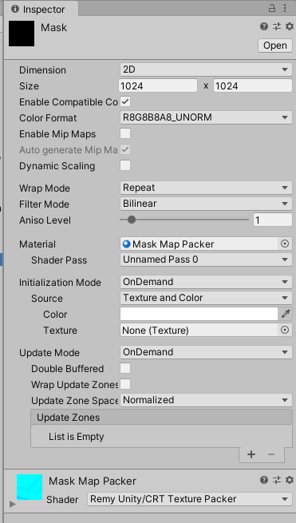
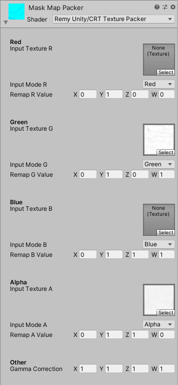
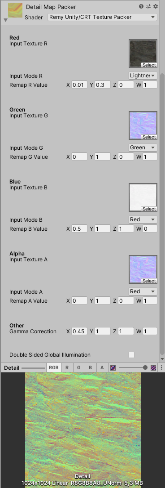

# CRT Texture Packer
The Custom Render Texture (CRT) Texture packer is a tool to help you pack multiples textures together in a single one.

This is particulary usefull when using the High Definition Render Pipeline, in order to pack downloaded textures to use as a Mask Map or a Detail Map.

## How to use

Start by creating a new material, and assign it the *Remy Unity/CRT Texture Packer* shader.

Then, create a new *Custom Render Texture* asset, set the texture settings at your needs, and assign the previously created material in the *Material* property

You can now start to plug you source textures.

Each channel section consists of 3 properties :

- **Input Texture *[C]*** : The source texture that will write in the channel.
- **Input Mode *[C]*** : What type of data of the texture will be written in the output:
  - **Red / Green / Blue / Alpha** : Select the individual input texture channel.
  - **Luminance / Average / Lightness** : Greyscale of the RGB channels.
- **Remap *[C]* Value** : Allows you to remap the input value to better suit you needs:
  - **X** : Minimum input value.
  - **Y** : Maximum input value.
  - **Z** : Minimum output value.
  - **W** : Maximum output value.

In addition to this, there is a *Gamma Correction* property to alter the output of each channel.

Here is an example setup to create an *HDRP Mask Map* :

The red channel remap outputs were set to minimum and maximum 0 to fill the **red** channel with 0 value. In the *Mask Map*, this is the *Metallic* information.
Similarly, the **blue** channel is filled with white, this is the *Detail Mask*.

The **green** channel is simple copying the *Ambient Occlusion* map.

The **alpha** channel has a *Roughness* texture plugged in. But the *HDRP Mask Map* needs *Smoothness*. Converting *Roughness* to *Smoothness* is just a matter of inverting the data, and this is done by settings the *Remap Minimum Output* (Z) to 1 and the *Remap Maximum Output* (W) to 0.

And an other example with a *HDRP Detail Map* :

Here, a *Normal Map* is plugged to copy the *Normal* **green** value to *Detail* **green** (*Detail Normal Y*), and *Normal* **red** value to *Detail* **alpha** (*Detail Normal X*).
An *Albedo* texture is outputting a it's remapped lightness to **red** (*Detail Albedo*), and a *Roughness* texture is remapped and inverted in **blue** (*Detail Smoothness*).
Note that the **red** output channel (*Albedo* in our case) has a 0.45 *Gamma Correction* to convert the color space.

You can assign those textures directly in a *HDRP/Lit material* and live preview your changes.

Once you are happy with them, you can export them as static textures, using the Custom Render Texture inspector menu (cogwheel on the top right) and click Export.